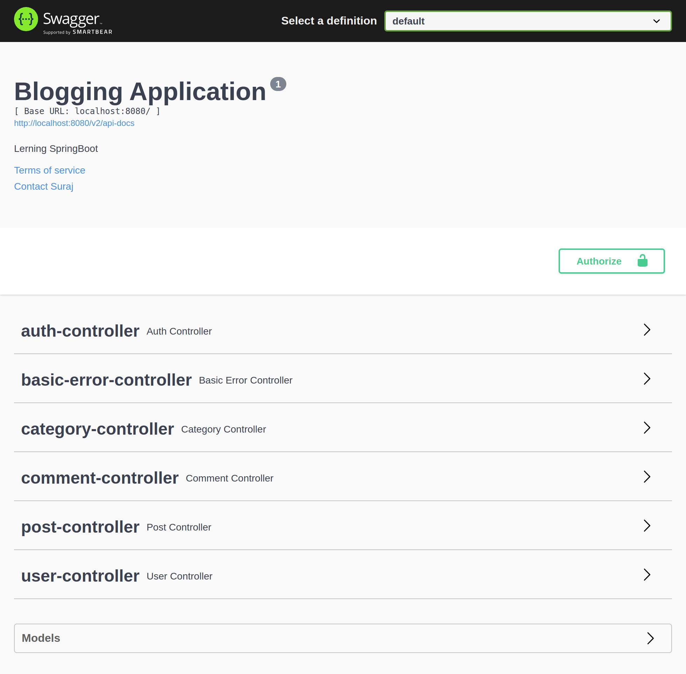

# Blogging Application

A simple backend app where users can create a blog 


## Self Learning

This project is made only of self-learning and is still in progress.

#### Skill  tested in this project.
- About MVC architecture
- Spring Security, form base authentication, and JWT token.
- Role-based authentication
- JPA, Hibernate, and Mysql
- Design pattern and code logic.


## Features Added

- Register and log in using email and password.
- JWT token authentication of every incoming request.
- Role base authentication of the user.
- The user can update his profile.
- User can create, update, delete add add images to a post.
- Users can tag a post with a category.


## Tech Stack

**Client:** Swagger Api

**Server:** SpringBoot, MySql, Spring Security, JPA, JDBC.


## How to use the APIs

To use the app follow the below steps.

- Install JDK and MySql databases.
- Clone the repo
- Configure db properties to the application.properties file.
- Now run the main function from project > src > java > com > blog > BlogApisApplication to start the server
- Go to the browser and enter the following link
http://localhost:8080/swagger-ui/index.html
- The above link will provide all the API in one place with a simple swagger UI.
- First, register yourself using register API from the auth controller
- Then login from the login API from the same controller, copy the token and add to Authorise with "Bearer" in front of the token value.
- Now you can access all the user-permitted APIs.

## Swagger Api


## Running the application locally

There are several ways to run a Spring Boot application on your local machine.

- One way is to execute the `main` method in the `src.main.java.com.contactManager.ContactManagerApplication`
  class from your IDE.


- Or you can use the command given below while in the target project:

```shell
mvn spring-boot:run
```

## 🚀 About Me

### Hi, I'm Suraj Verma! 👋

I'm a full stack developer...
<br>
`vermasuraj@gmail.com`

[](https://surajverma008.netlify.app/) <br>
[](https://www.linkedin.com/in/surajverma008/)